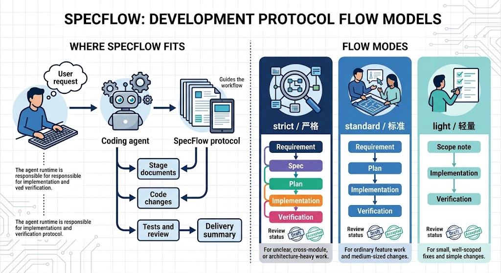

# SpecFlow

**SpecFlow 是面向 coding agent 的 skill-first 开发流程协议。**

[English README](README.md)

SpecFlow 为 coding agent 提供轻量、可审查的软件变更流程。它定义阶段边界和文档约定；它不替代负责读代码、改文件、跑测试或做 review 的 agent runtime。

## 流程模式



- 严格：适合需求不清、跨模块或高风险变更。
- 标准：适合普通功能开发。
- 轻量：适合范围明确的小改动。

每种模式都保留足够的过程记录，方便人类和后续 agent 审查“改了什么”和“为什么改”。

## 安装

SpecFlow 使用标准 Python 打包元数据，并提供 `justfile` 作为常用开发命令入口。这些 recipe 使用 `uv` 执行依赖管理相关命令。

安装包和开发依赖：

```bash
just install
```

SpecFlow 的 skill 源文件位于 `.claude/skills/specflow/`。请通过所用 coding-agent runtime 的 skill 机制安装或同步它。

## 使用

SpecFlow 的主要入口是 coding agent 的 skill（例如 Claude Code 中的 `/specflow`），不是 CLI。CLI 只用于初始化和诊断。

当一段讨论已经准备进入可追踪的软件变更时，告诉 agent：使用哪个流程模式，以及从哪个阶段开始。

### 选择流程模式

- 严格：适合需求不清、跨模块或高风险变更。流程为：需求 → 规格 → 计划 → 实现 → 验证。
- 标准：适合普通功能开发。流程为：需求 → 计划 → 实现 → 验证。
- 轻量：适合范围明确的小改动。流程为：需求 → 实现 → 验证。

轻量模式也会保留经过适中澄清的需求和验证记录，避免变成没有过程记录的直接改代码或极简验收备注。

### 启动方式

先用自然语言和 agent 讨论需求，澄清目标、约束、示例和边界情况。准备进入流程时，再启动 `/specflow`。agent 会创建或更新对应阶段文档，请你审查。阶段文档使用 `Draft` 和 `Accepted` 两种状态。

启动严格模式，并从需求开始：

```text
使用 /specflow 严格模式：为日志文件保留 7 天，开始 Requirement。
```

启动标准模式，并从需求开始：

```text
使用 /specflow 标准模式：新增导出报表功能，开始 Requirement。
```

启动轻量模式，处理范围明确的小改动，并从需求开始：

```text
使用 /specflow 轻量模式：统一所有模态窗的取消和确认按钮顺序，开始 Requirement。
```

在需求阶段，如果仍有假设、风险或未决问题，agent 会在阶段文档和回复中明确列出。只要你仍然要求继续，SpecFlow 会把这些内容记录为风险或假设，然后推进到目标阶段。启动 light / 轻量模式并从 Requirement / 需求开始时，agent 只应创建或更新需求草稿并请求审查；不要在同一轮直接实现或验证。

### 推进阶段

审查时直接用自然语言回复即可。你不需要输入 `next`、`approve` 这类命令式跳转；只要说明要调整什么，或要进入哪个阶段。

接受当前需求，并开始规格：

```text
可以，开始 Spec。
```

接受当前需求，并开始计划：

```text
接受，开始 Plan。
```

接受前置阶段，进入实现，并在已接受范围内完成改动：

```text
确认，开始 Implementation。
```

### 交付阶段

默认情况下，实现完成后先人工查看实现摘要、实际 diff、未运行检查、风险和可能的范围偏离。确认可以验收后，再明确要求 agent 进入 Verification：

```text
实现看起来可以接受，开始 Verification。
```

如果你明确要求 agent 连续完成实现和验证，agent 可以在先展示实现摘要和验证前风险后进入 Verification。SpecFlow 不会在 Verification 前写建议 commit message，也不会自动执行 `git add`、`git commit` 或 `git push`。

## CLI

CLI 是给 skill 使用的初始化和诊断辅助，不是用户主要入口：

```bash
specflow init
specflow status
```

普通功能开发通常从 `/specflow` 开始；CLI 只用于初始化和状态诊断。

## 文档

SpecFlow 按 feature 存放阶段文档：

```text
docs/requirement/<yyyymmdd>-<feature>.md
docs/spec/<yyyymmdd>-<feature>.md
docs/plan/<yyyymmdd>-<feature>.md
docs/verification/<yyyymmdd>-<feature>.md
```

新文档只使用两种审查状态：`Draft` 和 `Accepted`。

## 开发

运行项目检查：

```bash
just check
```

直接运行测试：

```bash
python -m pytest -q
```

构建 source 和 wheel distributions：

```bash
just build
```

## 许可证

SpecFlow 使用 [MIT License](LICENSE) 开源。
